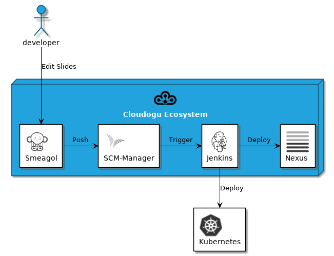

# Sprites for PlantUML

This repository includes a set of logos from [Cloudogu EcoSystem](https://cloudogu.com) Dogus and other tools for using as [Sprites](http://plantuml.com/sprite) in [PlantUML](http://plantuml.com). BTW: Check out our Git based wiki [Smeagol](https://github.com/cloudogu/smeagol) which has rich PlantUML support!

This work was inspired by [tupadr3/plantuml-icon-font-sprites](https://github.com/tupadr3/plantuml-icon-font-sprites). (Note: if you use their sprites in the same PlantUML diagram with sprites from this repo, you don't have to include the file common.puml from their repo. The code is already in common.puml of this repo.)

## Usage

First include the file common.puml either via path or url. It also contains style definitions according to the Cloudogu CI

```
[...]
!include ../common.puml
!includeurl https://raw.githubusercontent.com/cloudogu/plantuml-cloudogu-sprites/master/common.puml
[...]
```
You can define a macro for the URL

```
[...]
!define CLOUDOGUURL https://raw.githubusercontent.com/cloudogu/plantuml-cloudogu-sprites/master
!includeurl CLOUDOGUURL/common.puml
[...]
```

Then include the sprites that you want to use 

```
[...]
!includeurl CLOUDOGUURL/dogus/scm.puml
!includeurl CLOUDOGUURL/dogus/smeagol.puml
[...]
```

To use the Sprites you can include their name directly with <<$name>>

```
[...]
node "Cloudogu Ecosystem" <<$cloudogu>> {
[...]
```

or add one of the defined macros. Prefix can be either 'DOGU' or 'TOOL':

```
[...]
<prefix>_<name>(alias)
<prefix>_<name>(alias,label)
<prefix>_<name>(alias,label,shape)
<prefix>_<name>(alias,label,shape,color)
[...]
```

## Complete Example
```
@startuml
!define CLOUDOGUURL https://raw.githubusercontent.com/cloudogu/plantuml-cloudogu-sprites/master
!includeurl CLOUDOGUURL/common.puml
!includeurl CLOUDOGUURL/dogus/jenkins.puml
!includeurl CLOUDOGUURL/dogus/cloudogu.puml
!includeurl CLOUDOGUURL/dogus/scm.puml
!includeurl CLOUDOGUURL/dogus/smeagol.puml
!includeurl CLOUDOGUURL/dogus/nexus.puml
!includeurl CLOUDOGUURL/tools/k8s.puml

node "Cloudogu Ecosystem" <<$cloudogu>> {
	DOGU_JENKINS(jenkins, Jenkins) #ffffff
	DOGU_SCM(scm, SCM-Manager) #ffffff
	DOGU_SMEAGOL(smeagol, Smeagol) #ffffff
	DOGU_NEXUS(nexus,Nexus) #ffffff
}

TOOL_K8S(k8s, Kubernetes) #ffffff

actor developer

developer -> smeagol : "Edit Slides"
smeagol -> scm : Push
scm -> jenkins : Trigger
jenkins -> nexus : Deploy
jenkins -> k8s : Deploy

@enduml
```



## List of all Dogu Sprites

| Sprite | Dogu name | Macro | Name |
|--------|-----------|-------|------|
|  | CAS | DOGU_CAS | $cas |
|  | Cloudogu | DOGU_CLOUDOGU | $cloudogu |
|  | Cockpit | DOGU_COCKPIT | $cockpit |
|  | Jenkins | DOGU_JENKINS | $jenkins |
|  | Nexus | DOGU_NEXUS | $nexus |
|  | Nginx | DOGU_NGINX | $nginx |
|  | OpenLDAP | DOGU_OPENLDAP | $openldap |
|  | PlantUML | DOGU_PLANTUML | $plantuml |
|  | Postfix | DOGU_POSTFIX | $postfix |
|  | Redmine | DOGU_REDMINE | $redmine |
|  | Registrator | DOGU_REGISTRATOR | $registrator |
|  | SCM Manager | DOGU_SCM | $scm |
|  | Smeagol | DOGU_SMEAGOL | $smeagol |
|  | Sonarqube | DOGU_SONARQUBE | $sonarqube |
|  | User management | DOGU_USERMGMT | $usermgmt |
|  | LDAP mapper | DOGU_LDAPMAPPER | $ldapmapper |
|  | jira | DOGU_JIRA | $jira |

## List of all other tools sprites

| Sprite | Tool name | Macro | Name |
|--------|-----------|-------|------|
|  | Ansible | TOOL_ANSIBLE | $ansible |
|  | Docker | TOOL_DOCKER | $docker |
|  | Elastic Search | TOOL_ELASTIC | $elastic |
|  | Etcd | TOOL_ETCD | $etcd |
|  | Grafana | TOOL_GRAFANA | $grafana |
|  | JUnit | TOOL_JUNIT | $junit |
|  | Kubernetes | TOOL_K8S | $k8s |
|  | Prometheus | TOOL_PROMETHEUS | $prometheus |
|  | QEmu | TOOL_QEMU | $qemu |
|  | Terraform | TOOL_TERRAFORM | $terraform |
|  | Ubuntu | TOOL_UBUNTU | $ubuntu |
|  | Virtualbox | TOOL_VIRTUALBOX | $virtualbox |
|  | VMWare | TOOL_VMWARE | $vmware |

All trademarks, product names and logos appearing above are the property of their respective owners, including in some instances Cloudogu GmbH. Any rights not expressly granted herein are reserved.

---
### What is Cloudogu?
Cloudogu is an open platform, which lets you choose how and where your team creates great software. Each service or tool is delivered as a [Dōgu](https://translate.google.com/?text=D%26%23x014d%3Bgu#ja/en/%E9%81%93%E5%85%B7), a Docker container, that can be easily integrated in your environment just by pulling it from our registry. We have a growing number of ready-to-use Dōgus, e.g. SCM-Manager, Jenkins, Nexus, SonarQube, Redmine and many more. Every Dōgu can be tailored to your specific needs. You can even bring along your own Dōgus! Take advantage of a central authentication service, a dynamic navigation, that lets you easily switch between the web UIs and a smart configuration magic, which automatically detects and responds to dependencies between Dōgus. Cloudogu is open source and it runs either on-premise or in the cloud. Cloudogu is developed by Cloudogu GmbH under [MIT License](https://cloudogu.com/license.html) and it runs either on-premise or in the cloud.

### How to get in touch?
Want to talk to the Cloudogu team? Need help or support? There are several ways to get in touch with us:

* [Website](https://cloudogu.com)
* [Mailing list](https://groups.google.com/forum/#!forum/cloudogu)
* [Email hello@cloudogu.com](mailto:hello@cloudogu.com)

---
&copy; 2018 Cloudogu GmbH - MADE WITH :heart: FOR DEV ADDICTS. [Legal notice / Impressum](https://cloudogu.com/imprint.html)
